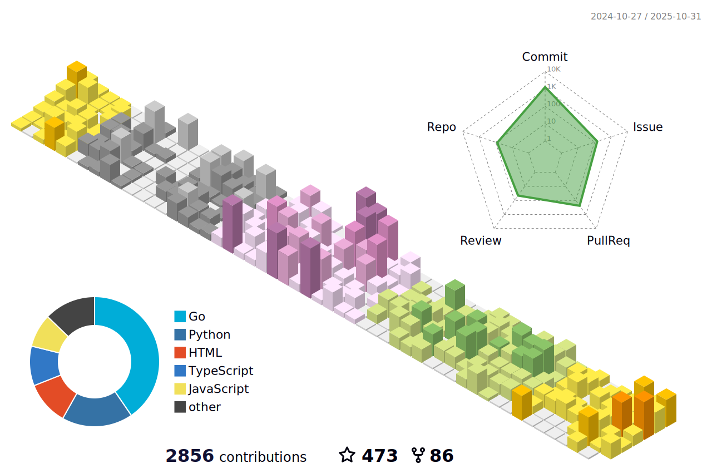

# Sam McLeod

> Hi I'm Sam 👋🏻

I'm a [1x Engineer](https://1x.engineer/) in the Platform/Automation/DevOps space.

Currently working as a fully-remote [Platform Engineering Lead](https://smcleod.net/cv/) in Melbourne, Australia.

## Contact

- 🌎 [smcleod.net](https://smcleod.net)
- 🐘 [Mastodon](https://aus.social/@s_mcleod)
- 🧑‍💻 [Github](https://www.github.com/sammcj)
- 🦃 [Twitter](https://www.twitter.com/sammcj)
- 👔 [LinkedIn](https://www.linkedin.com/in/sammcj)

---

## Latest Blog Posts

From [smcleod.net](https://smcleod.net)

<!-- BLOG-POST-LIST:START -->
- [Energy, Sustainability and Deployment Frequency](https://smcleod.net/2022/12/energy-sustainability-and-deployment-frequency/)
- [Zsh Configuration and Plugins - Part Two](https://smcleod.net/2022/11/zsh-configuration-and-plugins-part-two/)
- [Github Not-So-Reusable Actions](https://smcleod.net/2022/11/github-not-so-reusable-actions/)
- [YAML Anchors and Aliases](https://smcleod.net/2022/11/yaml-anchors-and-aliases/)
- [Zsh Configuration and Plugins - Part One](https://smcleod.net/2022/11/zsh-configuration-and-plugins-part-one/)
- [Encourage Your Peers To Contribute To Open Source](https://smcleod.net/2022/10/encourage-your-peers-to-contribute-to-open-source/)
- [Making Work Visible - Avoid DMs](https://smcleod.net/2022/10/making-work-visible-avoid-dms/)
- [The Best Of - 2022 Edition](https://smcleod.net/2022/10/the-best-of-2022-edition/)
- [It&#39;s 2022 and we&#39;re &lpar;still&rpar; not deploying enough](https://smcleod.net/2022/08/its-2022-and-were-still-not-deploying-enough/)
- [DALL·E 2 - Selected works](https://smcleod.net/2022/07/dalle-2-selected-works/)
<!-- BLOG-POST-LIST:END -->

---

## Github Stats

### Public Repository Stats

<!-- markdownlint-disable-next-line -->

